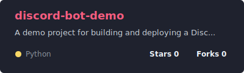
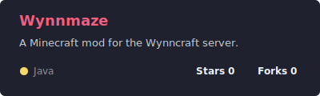
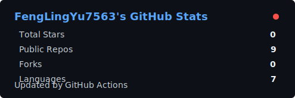
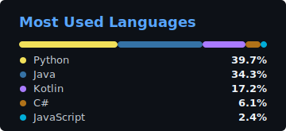

  

  

  

## About me

- Currently learning software development and practical AI agents.
- Interested in web development, automation, and creative projects.

  

## Some Languages and Tools I Use

  
  
  
  
   
  
  
  
  

## Projects

  
  

## GitHub Stats

  
  

## How to reach me

  

